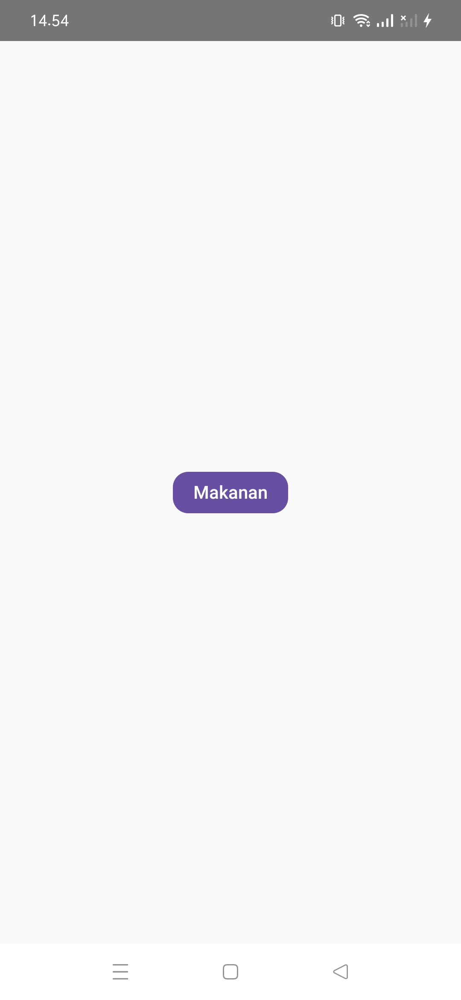
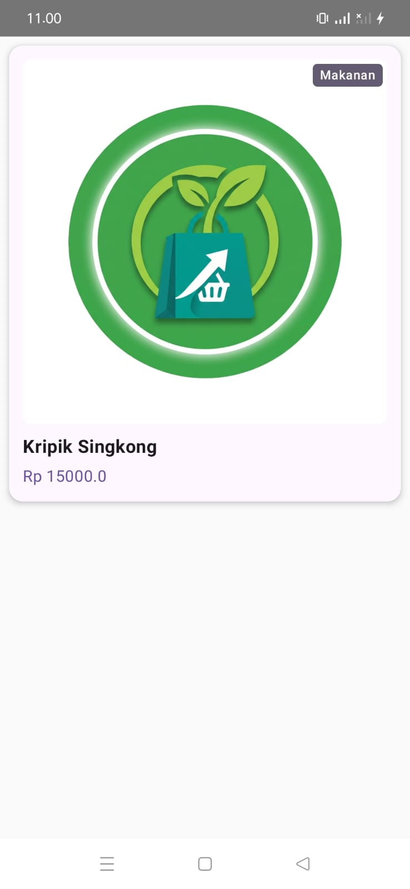
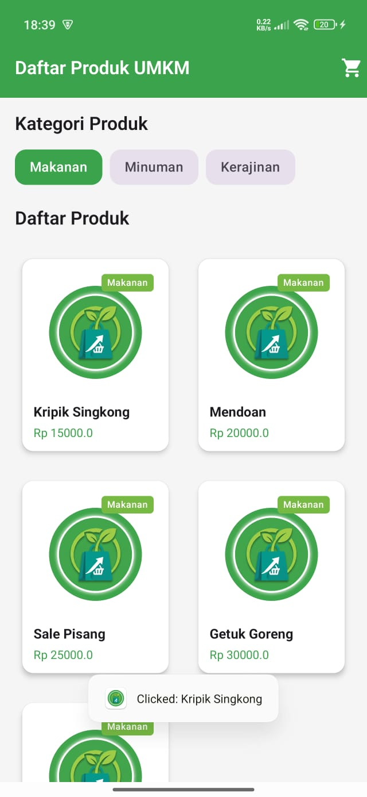
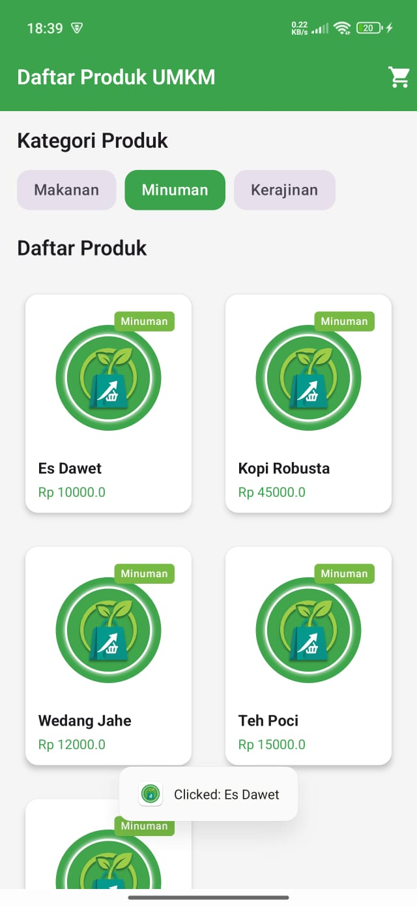
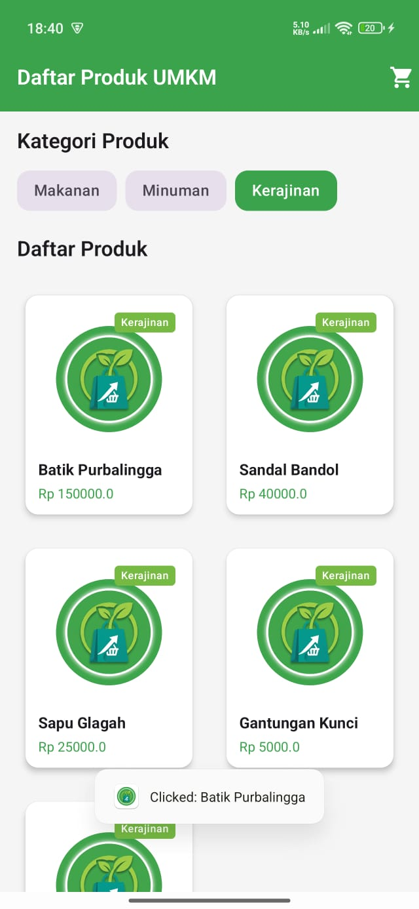
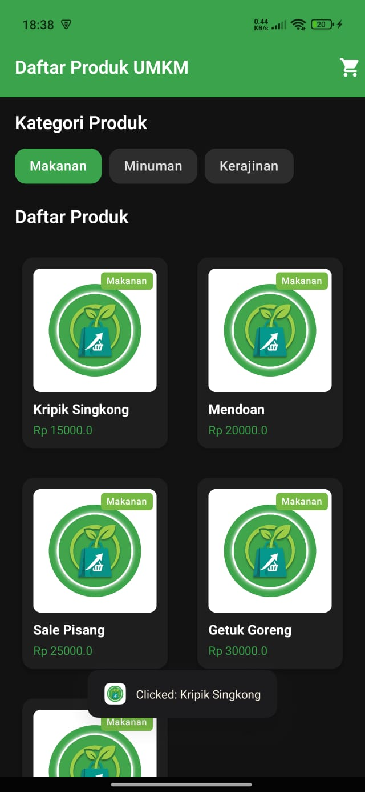
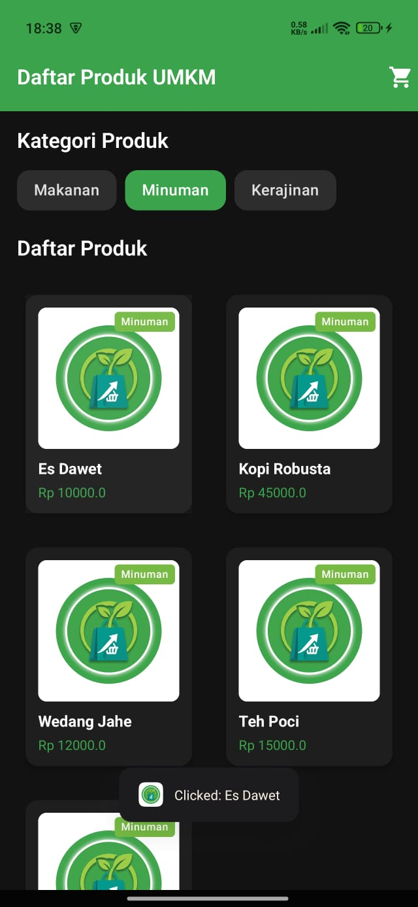
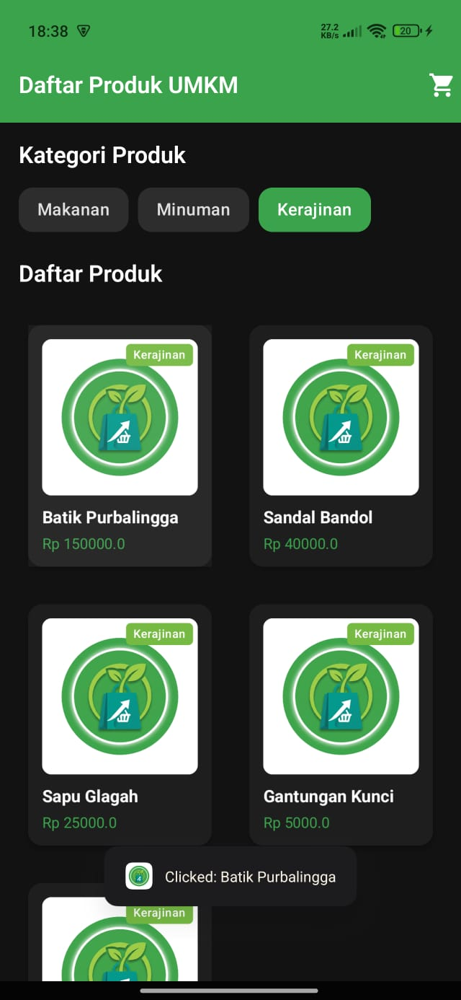

# H1D024028-Praktikum-Mobile-Kotlin

## Identitas

**Nama  :** Nadine Ariesta

**NIM   :** H1D024028

**Shift :** F

---

## Display Pertemuan 1

### Deskripsi tugas

Membuat project dan mempelajari dasar-dasar Jetpack Compose.

## Display Pertemuan 2

### Deskripsi tugas

Mempelajari Material Design 3 serta penerapan komponen dan formulir interaktif pada Jetpack Compose.

☀️ **Mode Terang**

<table border="1">
  <tr>
    <td align="center" width="50%">
      
    </td>
    <td align="center" width="50%">
      
    </td>
  </tr>
</table>

🌙 **Mode Gelap**

<table border="1">
  <tr>
    <td align="center" width="50%">
      
    </td>
    <td align="center" width="50%">
      
    </td>
  </tr>
</table>

## Display Pertemuan 3

### Deskripsi tugas

Mempelajari pembuatan daftar dinamis menggunakan Lazy Layouts pada Jetpack Compose.

**1. Preview**

<table border="1">
  <tr>
    <td align="center" width="50%">
      <b>Preview Kategori</b> 
      
    </td>
    <td align="center" width="50%">
      <b>Preview Produk</b> 
      
    </td>
  </tr>
</table>

**2. Daftar Produk UMKM**

<table border="1">
  <tr>
    <td align="center">
      
    </td>
  </tr>
</table>

**3. Dark & Light Theme Preview**

☀️ **Mode Terang**

<table border="1">
  <tr>
    <td align="center" width="50%">
      
    </td>
    <td align="center" width="50%">
      
    </td>
  </tr>
  <tr>
    <td align="center" colspan="2">
      
    </td>
  </tr>
</table>

🌙 **Mode Gelap**

<table border="1">
  <tr>
    <td align="center" width="50%">
      
    </td>
    <td align="center" width="50%">
      
    </td>
  </tr>
  <tr>
    <td align="center" colspan="2">
      
    </td>
  </tr>
</table>

